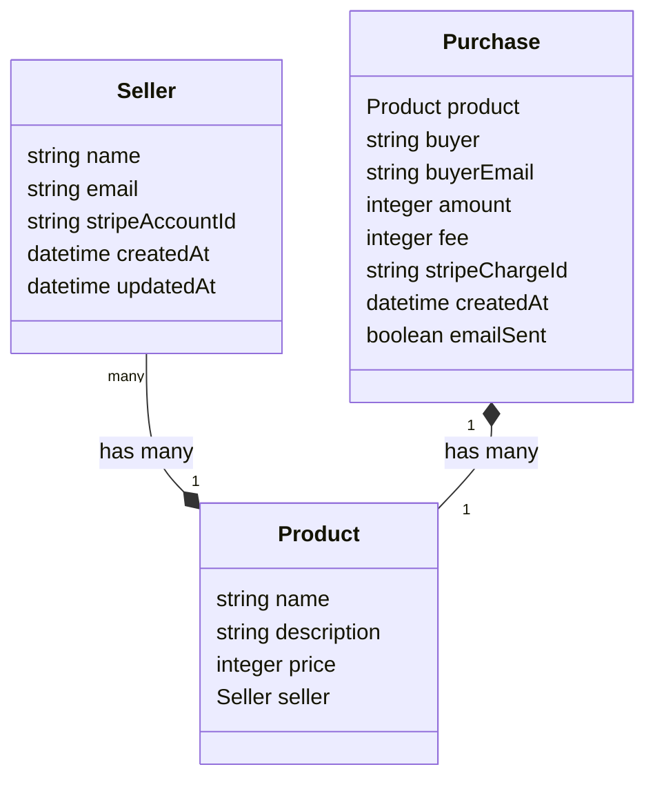

# Revv Stripe Storefront

This project is an e-commerce application built with AWS Amplify, Next.js, Stripe, and GraphQL. It provides a platform for sellers to connect their Stripe accounts, create and manage products, and receive payments from buyers. The application leverages various AWS services, including Lambda functions, API Gateway, and DynamoDB, to handle server-side logic and data storage.

## Features

- **Stripe Connect Integration:** The project integrates Stripe Connect, allowing sellers to connect their Stripe accounts and receive payments. This is implemented through the [`/api/generateStripeConnectUrl`](https://github.com/dereknorrbom/revv-stripe-storefront/blob/main/amplify/functions/generateStripeConnectUrl/handler.ts) and [`/api/stripeConnectCallback`](https://github.com/dereknorrbom/revv-stripe-storefront/blob/main/amplify/functions/stripeConnectCallback/handler.ts) endpoints.

- **Stripe Checkout Integration:** The project integrates Stripe Checkout, enabling buyers to make payments securely. This is implemented through the [`/api/createCheckoutSession`](https://github.com/dereknorrbom/revv-stripe-storefront/blob/main/amplify/functions/createCheckoutSession/handler.ts) endpoint.

- **Product Management:** Sellers can create, update, and delete products using the GraphQL API. The product data is stored in DynamoDB.

- **Viewing Purchases:** The `getPurchaseDetails` Lambda function retrieves the details of a purchase, which can be viewed by the seller in their Stripe account. This is implemented through the [`/api/getPurchaseDetails`](https://github.com/dereknorrbom/revv-stripe-storefront/blob/main/amplify/functions/getPurchaseDetails/handler.ts) endpoint.

- **Platform Fee:** The `createCheckoutSession` Lambda function includes the necessary configuration to split the payment between the platform and the seller, applying a platform fee of 10%. This is implemented through the [`/api/createCheckoutSession`](https://github.com/dereknorrbom/revv-stripe-storefront/blob/main/amplify/functions/createCheckoutSession/handler.ts) endpoint.

- **Buyer Experience:** Buyers can view products, view product details, and make purchases using Stripe Checkout. After a successful purchase, the `sendPurchaseEmail` Lambda function sends a confirmation email to the buyer.

- **Deployment:** The project is deployed to AWS using AWS Amplify, and the source code is available on GitHub.

- **Fixed-Point Arithmetic For Currency:** Using floating-point arithmetic for currency calculations can lead to precision errors due to the way floating-point numbers are represented in memory. These errors can accumulate over transactions, leading to significant discrepancies in financial applications. Here's a demonstration in an Interactive Ruby (IRB) session:

```ruby
2.7.0 :001 > a = 0.1
 => 0.1 
2.7.0 :002 > b = 0.2
 => 0.2 
2.7.0 :003 > c = a + b
 => 0.3 
2.7.0 :004 > puts "a + b = #{c}"
a + b = 0.30000000000000004
 => nil 
```

## Architecture Overview

The Revv Stripe Storefront application follows a serverless architecture, leveraging various AWS services and integrating with Stripe for payment processing. Here's an overview of the main components:

- **Next.js:** The frontend of the application is built using Next.js, a React framework for server-rendered applications. It provides a seamless user experience and handles client-side rendering.

- **AWS Amplify:** Amplify is used as the backend framework, providing a set of tools and services to build and deploy the application. It simplifies the setup and configuration of various AWS services.

- **API Gateway:** The application utilizes API Gateway to create RESTful APIs that interact with Lambda functions. It acts as the entry point for client requests and routes them to the appropriate Lambda functions.

- **Lambda Functions:** The server-side logic is implemented using Lambda functions. These functions handle various tasks, such as creating Stripe Checkout sessions, retrieving purchase details, sending emails, and managing Stripe Connect flows.

- **DynamoDB:** DynamoDB is used as the primary database for storing seller, product, and purchase information. It provides a scalable and flexible NoSQL database solution.

- **Stripe:** The application integrates with Stripe for payment processing. It utilizes Stripe Checkout for a seamless payment experience and Stripe Connect to allow sellers to connect their Stripe accounts and receive payments.

- **GraphQL:** The application uses GraphQL for querying and mutating data related to products, sellers, and purchases. Amplify's GraphQL API simplifies the setup and interaction with the GraphQL backend.

## Stripe Integration

The application integrates with Stripe for payment processing and seller onboarding. Here are the key aspects of the Stripe integration:

- **Stripe Checkout:** The application creates a Stripe Checkout session using the `createCheckoutSession` Lambda function whenever a buyer initiates a purchase. This process redirects the buyer to the Stripe Checkout page to complete the payment.

- **Stripe Connect:** The `generateStripeConnectUrl` Lambda function generates a unique URL for sellers to connect their Stripe accounts to the platform using Stripe Connect. Once a seller successfully connects their account, the application triggers the `stripeConnectCallback` Lambda function to update the seller's Stripe account ID in the database.

- **Payment Processing:** The application invokes the `getPurchaseDetails` Lambda function to retrieve purchase details, including the payment amount, transaction ID, and associated product information, whenever a buyer completes a payment through Stripe Checkout. It then triggers the `sendPurchaseEmail` Lambda function to send a confirmation email to the buyer.

- **Seller Payouts:** The application transfers funds from the buyer to the seller's connected Stripe account to support seller payouts. The `createCheckoutSession` Lambda function configures the necessary settings to split the payment between the platform and the seller, applying a platform fee of 10%.

## GraphQL Schema

The application uses GraphQL to define the schema for the data models and their relationships. The main data models are:

- **Product:** This model represents a product listed by a seller. It includes fields such as name, description, price, and the associated seller.

- **Seller:** This model represents a seller on the platform. It includes fields such as name, email, and the associated Stripe account ID.

- **Purchase:** This model represents a purchase made by a buyer. It includes fields such as the associated product, buyer details, payment amount, transaction ID, and the seller's Stripe account ID.

The Amplify CLI defines the GraphQL schema and automatically generates it based on the specified data models and their relationships.



## API Endpoints

- `/api/sendPurchaseEmail`: Triggers the `sendPurchaseEmail` Lambda function to send a confirmation email to the buyer after a successful purchase.

- `/api/createCheckoutSession`: Calls the `createCheckoutSession` Lambda function to create a Stripe Checkout session for a specific product.

- `/api/getPurchaseDetails`: Invokes the `getPurchaseDetails` Lambda function to retrieve the details of a purchase based on the provided session ID.

- `/api/stripeConnectCallback`: Handles the callback from Stripe Connect after a seller successfully connects their Stripe account. It triggers the `stripeConnectCallback` Lambda function to update the seller's Stripe account ID in the database.

- `/api/generateStripeConnectUrl`: Calls the `generateStripeConnectUrl` Lambda function to generate a unique URL for initiating the Stripe Connect flow.

- `/api/retrieveStripeAccountId`: Invokes the `retrieveStripeAccountId` Lambda function to retrieve the Stripe account ID associated with a seller based on the provided authorization code.

To accelerate development, this project uses the GraphQL schema for storage in the backend but it doesn't use custom GraphQL API resolvers for triggering backend actions.  It uses simple Lambda function URLs instead.

## Prerequisites

Before getting started with the project, ensure you have the following prerequisites installed:

- Node.js
- AWS CLI
- Amplify CLI

## Getting Started

To set up the project locally, follow these steps:

1. Clone the repository:
   ```
   git clone https://github.com/dereknorrbom/revv-stripe-storefront.git
   ```

2. Change into the project directory:
   ```
   cd revv-stripe-storefront
   ```

3. Install the dependencies:
   ```
   npm install
   ```

4. Configure your AWS credentials using the AWS CLI:
   ```
   aws configure
   ```

5. Initialize the Amplify project:
   ```
   npx amplify sandbox
   ```

6. Start the development server:
   ```
   npm run dev
   ```

The application should now be running locally at http://localhost:3000.

## Deployment

To deploy the application to AWS, follow these steps:

1. Connect your deployment branch to AWS Amplify Gen2 through the AWS Console.

2. Push the changes to your repository.

Amplify will handle the deployment of the frontend and backend resources, including the Next.js application, Lambda functions, API Gateway, and DynamoDB tables.

## To-do

A backlog of upcoming issues, were this project to go any farther:

* Set up custom GraphQL resolvers for API actions. #YAGNI
* Move Lambda function environment variables to AWS Secrets Manager or SSM parameter store. #DRY
* Implement queuing for resiliency, to defend against failures from SES or whatever.
* Add CloudWatch dashboards for monitoring sales and operational metrics.

## License

This project is licensed under the MIT License. You are free to use, modify, and distribute the code for personal or commercial purposes.